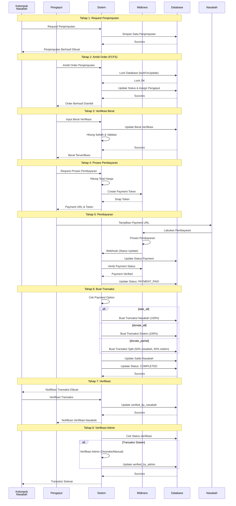
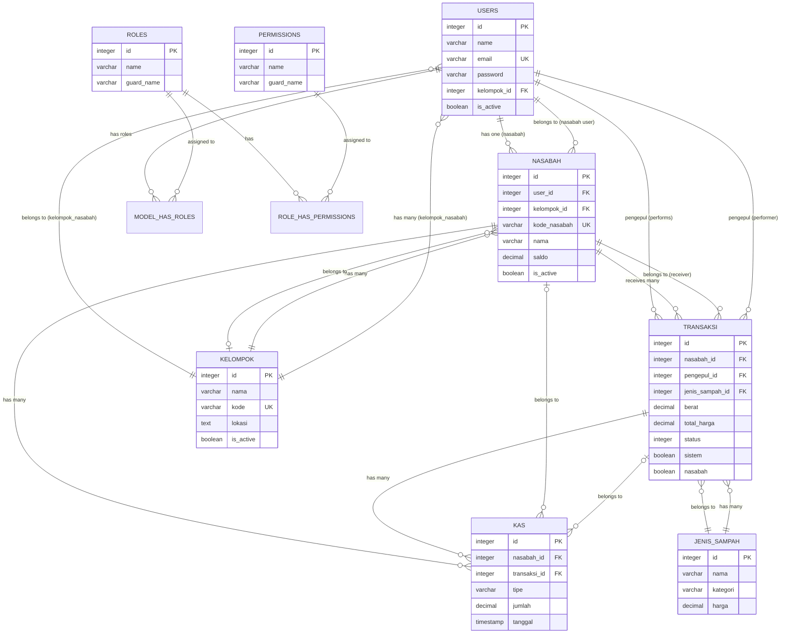
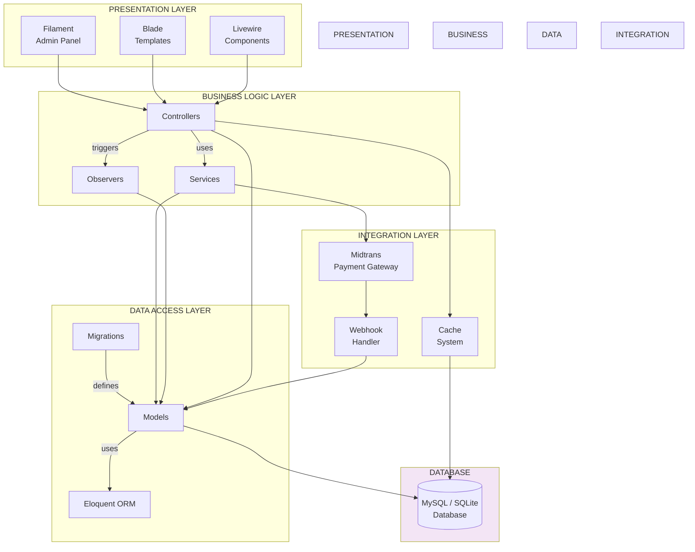

# BAB 3 METODE PENELITIAN

## 3.1 Metode Pengembangan Sistem

### 3.1.1 Metode Waterfall

Pengembangan sistem manajemen sampah ini menggunakan **Metode Waterfall** (Air Terjun). Metode Waterfall merupakan model pengembangan perangkat lunak yang bersifat linear dan berurutan, dimana setiap tahap harus diselesaikan sepenuhnya sebelum melanjutkan ke tahap berikutnya.

Model Waterfall terdiri dari beberapa tahapan utama sebagai berikut:

1. **Requirement Analysis (Analisis Kebutuhan)**
   - Identifikasi kebutuhan sistem berdasarkan kebutuhan pengguna
   - Pengumpulan data dan analisis kebutuhan fungsional dan non-fungsional
   - Dokumentasi requirement dalam bentuk spesifikasi kebutuhan

2. **System Design (Perancangan Sistem)**
   - Perancangan arsitektur sistem
   - Perancangan database (ERD)
   - Perancangan antarmuka pengguna
   - Perancangan alur proses bisnis

3. **Implementation (Implementasi)**
   - Pengembangan sistem berdasarkan desain yang telah dibuat
   - Pengkodean menggunakan framework Laravel 11 dan Filament 3.3
   - Integrasi dengan payment gateway Midtrans

4. **Integration & Testing (Integrasi dan Pengujian)**
   - Pengujian unit untuk setiap modul
   - Pengujian integrasi antar modul
   - Pengujian sistem secara keseluruhan
   - Pengujian fungsionalitas dan user acceptance testing

5. **Deployment (Penerapan)**
   - Deployment sistem ke server production
   - Konfigurasi server dan database
   - Migrasi data jika diperlukan

6. **Maintenance (Pemeliharaan)**
   - Monitoring sistem
   - Perbaikan bug dan error
   - Update dan perbaikan sistem

**Kelebihan Metode Waterfall:**
- Mudah dipahami dan diimplementasikan
- Cocok untuk proyek dengan requirement yang jelas dan stabil
- Dokumentasi yang terstruktur di setiap tahap
- Mudah untuk tracking progress

**Kelemahan Metode Waterfall:**
- Tidak fleksibel terhadap perubahan requirement
- Testing baru dilakukan di akhir siklus
- Sulit untuk kembali ke tahap sebelumnya jika ada kesalahan

Metode Waterfall dipilih karena kebutuhan sistem sudah jelas dan stabil, serta proyek ini memiliki timeline yang terdefinisi dengan baik.

---

## 3.2 Perancangan Sistem

### 3.2.1 Gambar 3.3 - Use Case Diagram

Gambar 3.3 menggambarkan interaksi antara aktor (Admin, Pengepul, Kelompok Nasabah, dan Nasabah) dengan sistem manajemen sampah.

```mermaid
graph TB
    subgraph "SISTEM MANAJEMEN SAMPAH"
        direction TB
        
        subgraph "Use Case Admin"
            UC1[Kelola User & Role]
            UC2[Kelola Nasabah]
            UC3[Kelola Kelompok]
            UC4[Kelola Jenis Sampah]
            UC5[Kelola Harga Sampah]
            UC6[Verifikasi Transaksi Sistem]
            UC7[Verifikasi Transaksi Nasabah]
            UC8[Kelola Pengeluaran]
            UC9[Kelola Artikel]
            UC10[Lihat Dashboard Admin]
            UC11[Lihat Laporan Keuangan]
            UC12[Lihat Log Aktivitas]
        end
        
        subgraph "Use Case Pengepul"
            UC13[Ambil Order Penjemputan]
            UC14[Verifikasi Berat Sampah]
            UC15[Input Berat Verifikasi]
            UC16[Proses Pembayaran]
            UC17[Buat Transaksi]
            UC18[Upload Bukti Pembayaran]
            UC19[Lihat Dashboard Pengepul]
            UC20[Lihat Jadwal Penjemputan]
        end
        
        subgraph "Use Case Kelompok Nasabah"
            UC21[Request Penjemputan]
            UC22[Input Estimasi Berat]
            UC23[Pilih Jenis Sampah]
            UC24[Pilih Opsi Pembayaran]
            UC25[Verifikasi Transaksi Nasabah]
            UC26[Lihat Dashboard Kelompok]
            UC27[Lihat Laporan Kelompok]
            UC28[Lihat Riwayat Penjemputan]
        end
        
        subgraph "Use Case Nasabah"
            UC29[Verifikasi Transaksi Sendiri]
            UC30[Lihat Riwayat Transaksi]
            UC31[Lihat Saldo]
            UC32[Lihat Artikel]
        end
    end
    
    Admin --> UC1
    Admin --> UC2
    Admin --> UC3
    Admin --> UC4
    Admin --> UC5
    Admin --> UC6
    Admin --> UC7
    Admin --> UC8
    Admin --> UC9
    Admin --> UC10
    Admin --> UC11
    Admin --> UC12
    
    Pengepul --> UC13
    Pengepul --> UC14
    Pengepul --> UC15
    Pengepul --> UC16
    Pengepul --> UC17
    Pengepul --> UC18
    Pengepul --> UC19
    Pengepul --> UC20
    
    KelompokNasabah --> UC21
    KelompokNasabah --> UC22
    KelompokNasabah --> UC23
    KelompokNasabah --> UC24
    KelompokNasabah --> UC25
    KelompokNasabah --> UC26
    KelompokNasabah --> UC27
    KelompokNasabah --> UC28
    
    Nasabah --> UC29
    Nasabah --> UC30
    Nasabah --> UC31
    Nasabah --> UC32
    
    style Admin fill:#e1f5ff
    style Pengepul fill:#fff4e1
    style KelompokNasabah fill:#e8f5e9
    style Nasabah fill:#fce4ec
```

**Gambar 3.3. Use Case Diagram Sistem Manajemen Sampah**

**Deskripsi Aktor:**
1. **Admin**: Bertanggung jawab mengelola seluruh aspek sistem, verifikasi transaksi, dan monitoring
2. **Pengepul**: Melakukan penjemputan sampah, verifikasi berat, dan proses pembayaran
3. **Kelompok Nasabah**: Mengelola kelompok nasabah dan membuat request penjemputan
4. **Nasabah**: Mengelola data diri dan verifikasi transaksi pribadi

---

### 3.2.2 Gambar 3.4 - Activity Diagram

Gambar 3.4 menggambarkan alur aktivitas proses penjemputan sampah dari request hingga completion.

```mermaid
flowchart TD
    Start([Start]) --> Request[Kelompok Nasabah Request Penjemputan]
    Request --> Input[Input Data Penjemputan]
    
    Input --> InputDetails[• Tanggal & Waktu<br/>• Alamat<br/>• Estimasi Berat<br/>• Jenis Sampah<br/>• Opsi Pembayaran]
    
    InputDetails --> Pending[Status: PENDING]
    Pending --> AmbilOrder{Pengepul Ambil Order<br/>FCFS}
    
    AmbilOrder -->|Database Lock| AssignPengepul[Assign Pengepul]
    AssignPengepul --> Assigned[Status: ASSIGNED]
    
    AmbilOrder -->|Tidak ada yang ambil| Pending
    
    Assigned --> Mulai[Pengepul Mulai Penjemputan]
    Mulai --> OnProgress[Status: ON_PROGRESS]
    
    OnProgress --> Verifikasi[Pengepul Verifikasi Berat]
    Verifikasi --> InputBerat[Input Berat Aktual]
    InputBerat --> Hitung[Hitung Selisih<br/>Cek Toleransi]
    
    Hitung --> BeratOK{Berat<br/>Valid?}
    BeratOK -->|Ya| WeightVerified[Status: WEIGHT_VERIFIED]
    BeratOK -->|Tidak| Verifikasi
    
    WeightVerified --> ProsesBayar[Pengepul Proses Pembayaran]
    ProsesBayar --> HitungHarga[Hitung Total Harga]
    HitungHarga --> PilihMetode[Pilih Metode Pembayaran]
    PilihMetode --> Integrasi[Integrasi Midtrans]
    
    Integrasi --> PaymentPending[Status: PAYMENT_PENDING]
    
    PaymentPending --> Bayar[Nasabah Bayar via Midtrans]
    Bayar --> MetodeBayar[• QRIS<br/>• Virtual Account<br/>• E-wallet]
    
    MetodeBayar --> Webhook[Midtrans Webhook]
    Webhook --> UpdateStatus[Update Status Otomatis]
    UpdateStatus --> PaymentPaid[Status: PAYMENT_PAID]
    
    PaymentPaid --> BuatTransaksi{Buat Transaksi}
    BuatTransaksi -->|take_all| TransNasabah[Transaksi Nasabah<br/>100% ke nasabah]
    BuatTransaksi -->|donate_all| TransSistem[Transaksi Sistem<br/>100% ke sistem]
    BuatTransaksi -->|donate_partial| TransSplit[Split Transaction<br/>50% nasabah, 50% sistem]
    
    TransNasabah --> UpdateSaldo
    TransSistem --> UpdateSaldo
    TransSplit --> UpdateSaldo
    
    UpdateSaldo[Update Saldo Nasabah] --> Completed[Status: COMPLETED]
    
    Completed --> VerifTransaksi[Verifikasi Transaksi]
    VerifTransaksi --> VerifNasabah[Verifikasi Nasabah]
    VerifNasabah --> VerifAdmin[Verifikasi Admin]
    
    VerifAdmin --> End([End])
    
    style Start fill:#90EE90
    style End fill:#FFB6C1
    style Pending fill:#FFE4B5
    style Assigned fill:#E6E6FA
    style OnProgress fill:#B0E0E6
    style WeightVerified fill:#87CEEB
    style PaymentPending fill:#F0E68C
    style PaymentPaid fill:#98FB98
    style Completed fill:#90EE90
```

**Gambar 3.4. Activity Diagram - Proses Penjemputan Sampah**

**Keterangan:**
- **FCFS (First Come First Served)**: Sistem pengambilan order berdasarkan siapa yang lebih cepat mengambil order
- **Database Lock**: Mekanisme untuk mencegah race condition saat pengambilan order
- **Toleransi Berat**: Sistem memvalidasi selisih berat antara estimasi dan aktual
- **Payment Options**: 
  - `take_all`: 100% pembayaran ke nasabah
  - `donate_all`: 100% donasi ke sistem
  - `donate_partial`: 50% ke nasabah, 50% ke sistem

---

### 3.2.3 Gambar 3.5 - Sequence Diagram

Gambar 3.5 menggambarkan urutan interaksi antar komponen dalam proses penjemputan dan pembayaran.

**Gambar 3.5. Sequence Diagram - Proses Penjemputan dan Pembayaran**

**Keterangan Tahapan:**
1. **Request Penjemputan**: Kelompok Nasabah membuat request penjemputan dengan data lengkap
2. **Ambil Order**: Pengepul mengambil order dengan mekanisme FCFS dan database lock
3. **Verifikasi Berat**: Pengepul menginput berat aktual dan sistem memvalidasi
4. **Proses Pembayaran**: Sistem membuat payment token dari Midtrans
5. **Pembayaran**: Nasabah melakukan pembayaran dan Midtrans mengirim webhook
6. **Buat Transaksi**: Sistem membuat transaksi berdasarkan payment option
7. **Verifikasi Nasabah**: Nasabah memverifikasi transaksi
8. **Verifikasi Admin**: Admin memverifikasi transaksi sistem

---

### 3.2.4 Gambar 3.6 - Entity Relationship Diagram (ERD)

Gambar 3.6 menggambarkan struktur database dan relasi antar entitas dalam sistem.

**Lihat file `ERD_JURNAL.md` bagian "Gambar 1: ERD Inti" untuk ERD lengkap.**

Atau menggunakan format Mermaid berikut:

**Gambar 3.6. Entity Relationship Diagram (ERD)**

**Tabel Utama:**
1. **USERS**: Menyimpan data pengguna (Admin, Pengepul, Kelompok Nasabah, Nasabah)
2. **KELOMPOK**: Menyimpan data kelompok nasabah
3. **NASABAH**: Menyimpan data nasabah dengan saldo
4. **TRANSAKSI**: Menyimpan data transaksi keuangan
5. **JENIS_SAMPAH**: Master data jenis sampah
6. **KAS**: Menyimpan catatan kas masuk/keluar
7. **ROLES**: Tabel roles untuk RBAC
8. **PERMISSIONS**: Tabel permissions untuk RBAC

---

### 3.2.5 Gambar 3.7 - Arsitektur Sistem

Gambar 3.7 menggambarkan arsitektur sistem secara keseluruhan dengan layer-layer yang digunakan.

**Gambar 3.7. Arsitektur Sistem**

**Keterangan Layer:**

1. **Presentation Layer (Lapisan Presentasi)**
   - **Filament Admin Panel**: Admin panel berbasis Laravel untuk manajemen sistem
   - **Blade Templates**: Template engine untuk rendering view
   - **Livewire Components**: Komponen interaktif untuk real-time updates

2. **Business Logic Layer (Lapisan Logika Bisnis)**
   - **Controllers**: Menangani request dan response HTTP
   - **Services**: Menangani logika bisnis yang kompleks (contoh: MidtransService)
   - **Observers**: Memantau perubahan model dan melakukan aksi otomatis

3. **Data Access Layer (Lapisan Akses Data)**
   - **Models**: Representasi entitas database
   - **Eloquent ORM**: Object-Relational Mapping untuk interaksi database
   - **Migrations**: Mengelola struktur database

4. **Integration Layer (Lapisan Integrasi)**
   - **Midtrans Payment Gateway**: Integrasi dengan payment gateway
   - **Webhook Handler**: Menangani callback dari external services
   - **Cache System**: Sistem caching untuk optimasi performa

5. **Database (Basis Data)**
   - **MySQL/SQLite**: Database untuk menyimpan data sistem

---

### 3.2.6 Gambar 3.8 - Alur Pengujian Sistem

Gambar 3.8 menggambarkan alur dan tahapan pengujian sistem yang dilakukan.

```mermaid
flowchart TD
    Start([Mulai Pengujian Sistem]) --> UnitTest[1. Unit Testing]
    
    UnitTest --> TestModel[Test Models<br/>• Validasi data<br/>• Relationship<br/>• Method logic]
    TestModel --> TestController[Test Controllers<br/>• Request handling<br/>• Response format<br/>• Error handling]
    TestController --> TestService[Test Services<br/>• Business logic<br/>• Calculation<br/>• Integration logic]
    
    TestService --> UnitOK{Unit Test<br/>Passed?}
    UnitOK -->|Tidak| FixBug1[Perbaiki Bug]
    FixBug1 --> UnitTest
    UnitOK -->|Ya| IntegrationTest
    
    IntegrationTest[2. Integration Testing]
    
    IntegrationTest --> TestAPI[Test API Integration<br/>• Midtrans Webhook<br/>• Payment Flow<br/>• Database Transaction]
    TestAPI --> TestDB[Test Database<br/>• CRUD Operations<br/>• Foreign Keys<br/>• Constraints]
    TestDB --> TestAuth[Test Authentication<br/>• Login/Logout<br/>• Role Permission<br/>• Access Control]
    
    TestAuth --> IntOK{Integration Test<br/>Passed?}
    IntOK -->|Tidak| FixBug2[Perbaiki Bug]
    FixBug2 --> IntegrationTest
    IntOK -->|Ya| SystemTest
    
    SystemTest[3. System Testing]
    
    SystemTest --> TestFlow[Test Business Flow<br/>• Penjemputan Flow<br/>• Payment Flow<br/>• Verification Flow]
    TestFlow --> TestPerf[Test Performance<br/>• Response Time<br/>• Database Query<br/>• Cache Effectiveness]
    TestPerf --> TestSec[Test Security<br/>• SQL Injection<br/>• XSS Protection<br/>• CSRF Protection]
    
    TestSec --> SysOK{System Test<br/>Passed?}
    SysOK -->|Tidak| FixBug3[Perbaiki Bug]
    FixBug3 --> SystemTest
    SysOK -->|Ya| UAT
    
    UAT[4. User Acceptance Testing]
    
    UAT --> TestAdmin[Test by Admin<br/>• User Management<br/>• Transaction Verification<br/>• Report Generation]
    TestAdmin --> TestPengepul[Test by Pengepul<br/>• Order Taking<br/>• Weight Verification<br/>• Payment Processing]
    TestPengepul --> TestNasabah[Test by Nasabah<br/>• Pickup Request<br/>• Transaction Verification<br/>• Balance Check]
    
    TestNasabah --> UATOK{UAT<br/>Passed?}
    UATOK -->|Tidak| FixBug4[Perbaiki Bug]
    FixBug4 --> UAT
    UATOK -->|Ya| RegressionTest
    
    RegressionTest[5. Regression Testing]
    
    RegressionTest --> TestExisting[Test Existing Features<br/>• Previous Functionality<br/>• Data Integrity<br/>• Compatibility]
    TestExisting --> RegOK{Regression Test<br/>Passed?}
    RegOK -->|Tidak| FixBug5[Perbaiki Bug]
    FixBug5 --> RegressionTest
    RegOK -->|Ya| FinalTest
    
    FinalTest[6. Final Testing]
    
    FinalTest --> TestProd[Production-like Testing<br/>• Load Testing<br/>• Stress Testing<br/>• End-to-End Testing]
    TestProd --> FinalOK{Final Test<br/>Passed?}
    FinalOK -->|Tidak| FixBug6[Perbaiki Bug]
    FixBug6 --> FinalTest
    FinalOK -->|Ya| DeployReady
    
    DeployReady[Sistem Siap<br/>untuk Deployment] --> End([Pengujian Selesai])
    
    style Start fill:#90EE90
    style End fill:#FFB6C1
    style UnitTest fill:#E6E6FA
    style IntegrationTest fill:#B0E0E6
    style SystemTest fill:#87CEEB
    style UAT fill:#F0E68C
    style RegressionTest fill:#98FB98
    style FinalTest fill:#90EE90
    style DeployReady fill:#FFD700
```

**Gambar 3.8. Alur Pengujian Sistem**

**Tahapan Pengujian:**

1. **Unit Testing**
   - Pengujian setiap unit kode secara individual
   - Fokus: Models, Controllers, Services
   - Tool: PHPUnit

2. **Integration Testing**
   - Pengujian integrasi antar komponen
   - Fokus: API integration, Database, Authentication
   - Memastikan komponen bekerja bersama dengan baik

3. **System Testing**
   - Pengujian sistem secara keseluruhan
   - Fokus: Business flow, Performance, Security
   - Memastikan sistem memenuhi requirement

4. **User Acceptance Testing (UAT)**
   - Pengujian oleh end-user
   - Fokus: Usability, Business requirements
   - Partisipan: Admin, Pengepul, Nasabah

5. **Regression Testing**
   - Pengujian ulang fitur yang sudah ada
   - Fokus: Memastikan fitur baru tidak merusak fitur lama
   - Dilakukan setiap kali ada perubahan

6. **Final Testing**
   - Pengujian akhir sebelum deployment
   - Fokus: Load testing, Stress testing, End-to-end
   - Memastikan sistem siap untuk production

---

## 3.3 Alat dan Teknologi

### 3.3.1 Perangkat Lunak
- **Framework**: Laravel 11
- **Admin Panel**: Filament 3.3
- **Database**: MySQL / SQLite
- **Payment Gateway**: Midtrans
- **Version Control**: Git
- **IDE**: Visual Studio Code / PhpStorm

### 3.3.2 Perangkat Keras
- **Server**: Apache/Nginx
- **Database Server**: MySQL Server
- **Web Browser**: Chrome, Firefox, Edge

---

**Catatan:**
- Semua diagram di atas dibuat menggunakan format Mermaid yang dapat dirender di berbagai platform
- Untuk penggunaan di jurnal, diagram dapat diexport sebagai gambar (PNG/SVG) dengan resolusi tinggi
- Tools yang bisa digunakan untuk export:
  - https://mermaid.live/
  - VS Code dengan ekstensi Mermaid
  - Draw.io (untuk versi yang lebih detail)
  - Lucidchart (untuk versi profesional)

