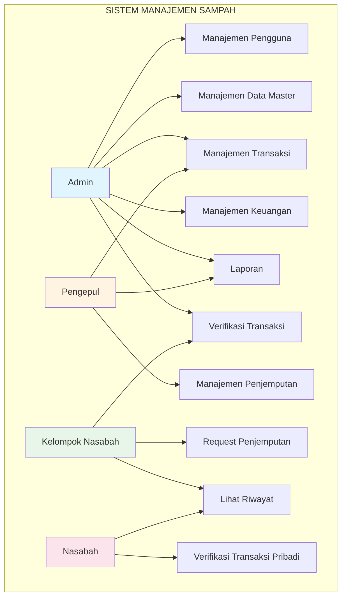
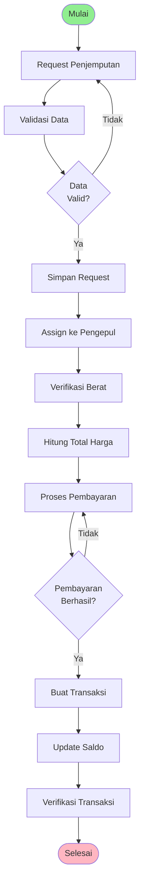
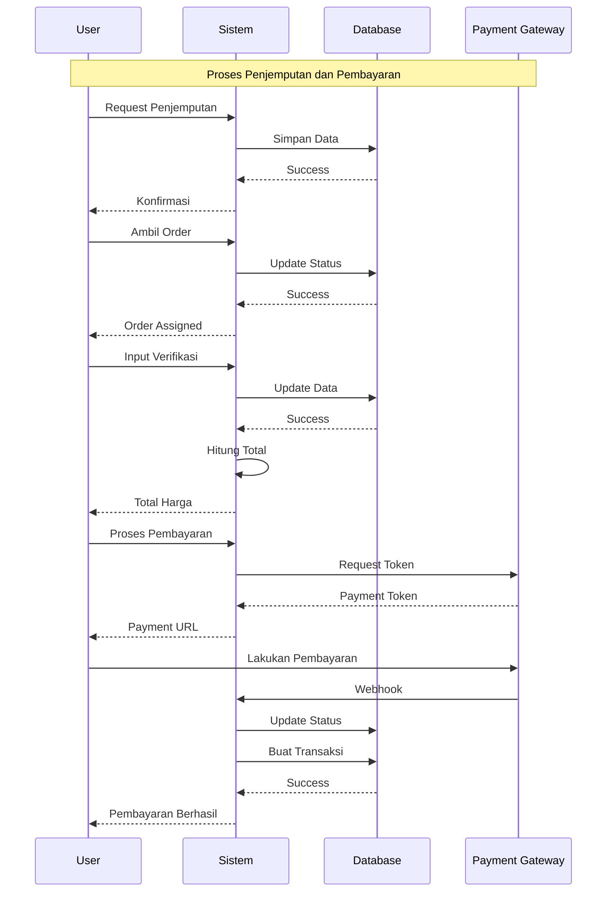
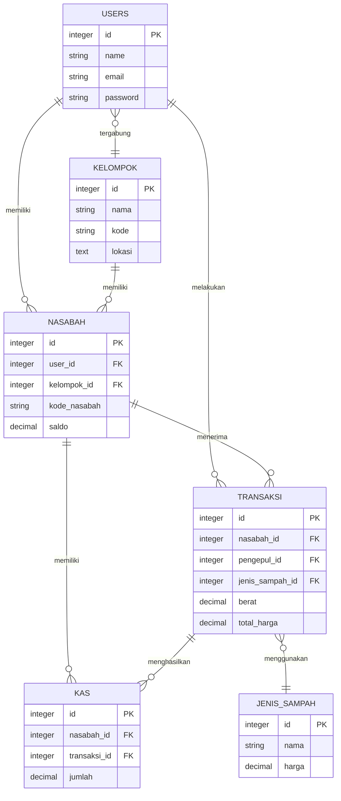
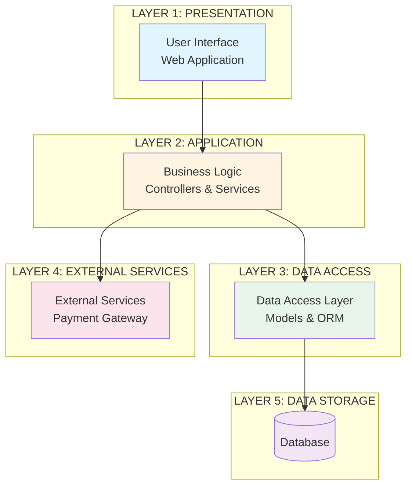
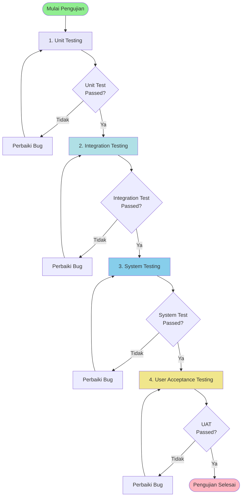

# BAB 3 METODE PENELITIAN

## 3.1 Metode Pengembangan Sistem

### 3.1.1 Metode Waterfall

Penelitian ini menggunakan **Metode Waterfall** (Air Terjun) sebagai metodologi pengembangan sistem. Metode Waterfall adalah model pengembangan perangkat lunak yang bersifat sequential dan linear, dimana setiap tahap harus diselesaikan sepenuhnya sebelum melanjutkan ke tahap berikutnya.

**Tahapan Metode Waterfall:**

1. **Analisis Kebutuhan (Requirement Analysis)**
   - Identifikasi kebutuhan sistem berdasarkan studi literatur dan observasi
   - Pengumpulan data kebutuhan pengguna melalui wawancara
   - Dokumentasi requirement dalam bentuk spesifikasi kebutuhan sistem

2. **Desain Sistem (System Design)**
   - Perancangan arsitektur sistem secara umum
   - Perancangan struktur database (ERD)
   - Perancangan antarmuka pengguna
   - Perancangan alur proses bisnis

3. **Implementasi (Implementation)**
   - Pengembangan sistem berdasarkan desain yang telah dibuat
   - Pengkodean menggunakan framework dan teknologi yang dipilih
   - Integrasi antar modul sistem

4. **Pengujian (Testing)**
   - Pengujian unit untuk setiap modul
   - Pengujian integrasi antar modul
   - Pengujian sistem secara keseluruhan
   - User acceptance testing

5. **Pemeliharaan (Maintenance)**
   - Monitoring dan pemeliharaan sistem
   - Perbaikan bug dan error
   - Update dan perbaikan sistem sesuai kebutuhan

**Alasan Pemilihan Metode Waterfall:**
- Kebutuhan sistem sudah jelas dan terdefinisi dengan baik
- Proyek memiliki timeline yang terstruktur
- Memudahkan dokumentasi dan tracking progress
- Cocok untuk pengembangan sistem dengan scope yang terbatas

---

## 3.2 Perancangan Sistem

Perancangan sistem dilakukan untuk menggambarkan bagaimana sistem akan bekerja secara konseptual sebelum implementasi. Perancangan ini mencakup perancangan fungsional, perancangan data, dan perancangan arsitektur sistem.

### 3.2.1 Perancangan Fungsional

Perancangan fungsional menggambarkan fungsi-fungsi yang harus dimiliki oleh sistem berdasarkan kebutuhan pengguna. Perancangan ini direpresentasikan dalam bentuk Use Case Diagram.

**Gambar 3.3 Use Case Diagram**

Use Case Diagram menggambarkan interaksi antara aktor (pengguna sistem) dengan sistem. Aktor dalam sistem ini terdiri dari:

1. **Admin**: Bertanggung jawab mengelola seluruh aspek sistem
2. **Pengepul**: Melakukan penjemputan sampah dan verifikasi
3. **Kelompok Nasabah**: Mengelola kelompok dan membuat request penjemputan
4. **Nasabah**: Mengelola data diri dan verifikasi transaksi

**Gambar 3.3. Use Case Diagram Sistem Manajemen Sampah**

**Deskripsi Use Case:**

1. **Manajemen Pengguna**: Mengelola data pengguna, role, dan permission
2. **Manajemen Data Master**: Mengelola data kelompok, jenis sampah, harga sampah
3. **Manajemen Penjemputan**: Mengelola proses penjemputan sampah
4. **Manajemen Transaksi**: Mengelola transaksi keuangan
5. **Manajemen Keuangan**: Mengelola kas dan pengeluaran
6. **Laporan**: Menampilkan laporan keuangan dan statistik
7. **Verifikasi Transaksi**: Memverifikasi transaksi oleh admin/nasabah
8. **Request Penjemputan**: Membuat permintaan penjemputan sampah
9. **Lihat Riwayat**: Melihat riwayat transaksi dan penjemputan
10. **Verifikasi Transaksi Pribadi**: Verifikasi transaksi oleh nasabah sendiri

---

### 3.2.2 Perancangan Proses Bisnis

Perancangan proses bisnis menggambarkan alur aktivitas dalam sistem. Alur utama yang dirancang adalah proses penjemputan sampah dari request hingga completion.

**Gambar 3.4 Activity Diagram**

Activity Diagram menggambarkan alur aktivitas proses penjemputan sampah secara umum.

**Gambar 3.4. Activity Diagram - Proses Penjemputan Sampah**

**Tahapan Proses:**
1. **Request Penjemputan**: Kelompok Nasabah membuat request penjemputan
2. **Validasi Data**: Sistem memvalidasi data yang diinput
3. **Assign ke Pengepul**: Sistem mengassign penjemputan ke pengepul
4. **Verifikasi Berat**: Pengepul melakukan verifikasi berat sampah
5. **Hitung Total Harga**: Sistem menghitung total harga berdasarkan berat dan harga
6. **Proses Pembayaran**: Sistem memproses pembayaran
7. **Buat Transaksi**: Sistem membuat record transaksi
8. **Update Saldo**: Sistem memperbarui saldo nasabah
9. **Verifikasi Transaksi**: Nasabah/Admin memverifikasi transaksi

---

### 3.2.3 Perancangan Interaksi Sistem

Perancangan interaksi menggambarkan bagaimana komponen-komponen sistem berinteraksi satu sama lain dalam melakukan proses bisnis.

**Gambar 3.5 Sequence Diagram**

Sequence Diagram menggambarkan interaksi antar komponen dalam proses penjemputan dan pembayaran.

**Gambar 3.5. Sequence Diagram - Proses Penjemputan dan Pembayaran**

**Komponen Sistem:**
- **User**: Pengguna sistem (Pengepul/Nasabah)
- **Sistem**: Aplikasi manajemen sampah
- **Database**: Penyimpanan data
- **Payment Gateway**: Layanan pembayaran eksternal

---

### 3.2.4 Perancangan Data

Perancangan data menggambarkan struktur data yang akan digunakan dalam sistem. Perancangan ini direpresentasikan dalam bentuk Entity Relationship Diagram (ERD).

**Gambar 3.6 Entity Relationship Diagram (ERD)**

ERD menggambarkan entitas-entitas utama dalam sistem dan relasi antar entitas.

**Gambar 3.6. Entity Relationship Diagram (ERD)**

**Entitas Utama:**
1. **USERS**: Menyimpan data pengguna sistem
2. **KELOMPOK**: Menyimpan data kelompok nasabah
3. **NASABAH**: Menyimpan data nasabah
4. **TRANSAKSI**: Menyimpan data transaksi keuangan
5. **JENIS_SAMPAH**: Master data jenis sampah
6. **KAS**: Menyimpan catatan kas masuk/keluar

**Relasi:**
- USERS memiliki NASABAH (one-to-one)
- USERS melakukan TRANSAKSI (one-to-many sebagai pengepul)
- KELOMPOK memiliki banyak NASABAH (one-to-many)
- NASABAH menerima banyak TRANSAKSI (one-to-many)
- TRANSAKSI menggunakan JENIS_SAMPAH (many-to-one)
- TRANSAKSI menghasilkan KAS (one-to-many)

---

### 3.2.5 Perancangan Arsitektur Sistem

Perancangan arsitektur menggambarkan struktur sistem secara keseluruhan dan bagaimana komponen-komponen sistem saling berinteraksi.

**Gambar 3.7 Arsitektur Sistem**

Arsitektur sistem dirancang menggunakan pendekatan layered architecture yang terdiri dari beberapa layer.

**Gambar 3.7. Arsitektur Sistem**

**Keterangan Layer:**

1. **Presentation Layer (Lapisan Presentasi)**
   - Menampilkan antarmuka pengguna
   - Menangani input dan output dari pengguna

2. **Application Layer (Lapisan Aplikasi)**
   - Mengimplementasikan logika bisnis
   - Menangani validasi dan proses bisnis

3. **Data Access Layer (Lapisan Akses Data)**
   - Mengelola interaksi dengan database
   - Menyediakan abstraksi data

4. **External Services Layer (Lapisan Layanan Eksternal)**
   - Integrasi dengan layanan eksternal
   - Payment gateway integration

5. **Data Storage Layer (Lapisan Penyimpanan Data)**
   - Database untuk menyimpan data sistem

---

## 3.3 Metodologi Pengujian

Metodologi pengujian menjelaskan tahapan dan metode pengujian yang akan dilakukan untuk memastikan sistem berfungsi dengan baik.

### 3.3.1 Strategi Pengujian

Strategi pengujian yang digunakan adalah bottom-up testing, yaitu pengujian dimulai dari unit terkecil kemudian meningkat ke level yang lebih tinggi.

**Gambar 3.8 Alur Pengujian Sistem**

Alur pengujian sistem menggambarkan tahapan pengujian yang akan dilakukan.

**Gambar 3.8. Alur Pengujian Sistem**

**Tahapan Pengujian:**

1. **Unit Testing**
   - Pengujian setiap unit kode secara individual
   - Fokus pada fungsi dan method dalam setiap modul
   - Memastikan setiap unit berfungsi sesuai spesifikasi

2. **Integration Testing**
   - Pengujian integrasi antar modul
   - Memastikan modul dapat bekerja bersama dengan baik
   - Menguji interface antar modul

3. **System Testing**
   - Pengujian sistem secara keseluruhan
   - Memastikan sistem memenuhi requirement fungsional
   - Pengujian performa dan keamanan

4. **User Acceptance Testing (UAT)**
   - Pengujian oleh end-user
   - Memastikan sistem dapat digunakan sesuai kebutuhan pengguna
   - Validasi bahwa sistem menyelesaikan masalah yang ada

### 3.3.2 Metode Pengujian

**Pengujian Fungsional:**
- Black box testing untuk menguji fungsionalitas sistem
- Menguji setiap use case yang telah didefinisikan
- Validasi input dan output sistem

**Pengujian Non-Fungsional:**
- Performance testing untuk menguji kinerja sistem
- Security testing untuk menguji keamanan sistem
- Usability testing untuk menguji kemudahan penggunaan

**Teknik Pengujian:**
- Manual testing untuk pengujian fungsionalitas
- Automated testing untuk pengujian unit dan integrasi
- User testing untuk UAT

---

## 3.4 Alat dan Teknologi

### 3.4.1 Perangkat Lunak
- **Framework Pengembangan**: Laravel 11
- **Admin Panel**: Filament 3.3
- **Database**: MySQL
- **Payment Gateway**: Midtrans
- **Version Control**: Git

### 3.4.2 Perangkat Keras
- **Server**: Apache/Nginx
- **Database Server**: MySQL Server
- **Web Browser**: Chrome, Firefox, Edge

---

**Catatan:**
- Diagram-diagram di atas dibuat dalam format Mermaid yang dapat diexport sebagai gambar
- Format diagram disesuaikan dengan kebutuhan dokumentasi metodologi penelitian
- Untuk penggunaan di jurnal, diagram dapat diexport sebagai PNG/SVG dengan resolusi tinggi

