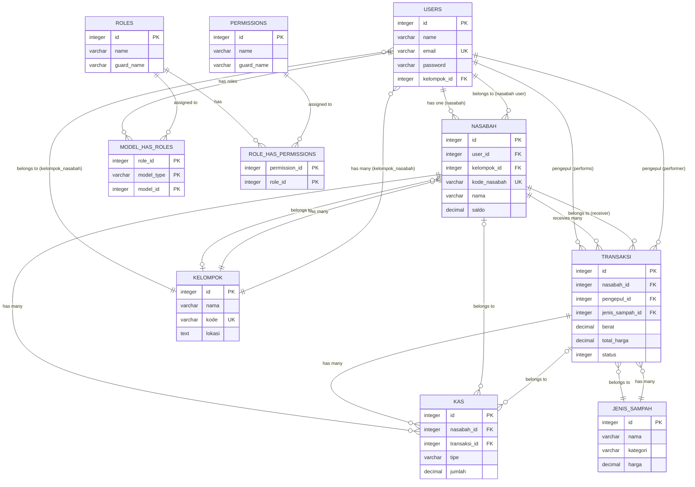
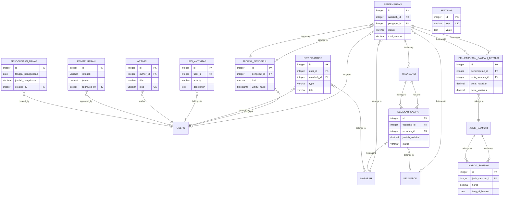

# ERD untuk Jurnal Akademik

## Gambar 1: ERD Inti (Compressed) - Untuk Metodologi

ERD ini fokus pada tabel-tabel utama yang menjadi core sistem.

### Format dbdiagram.io (DBML)

```dbml
// ERD Inti Sistem Manajemen Sampah
// Fokus pada tabel utama: USERS, KELOMPOK, NASABAH, TRANSAKSI, JENIS_SAMPAH, KAS, ROLES, PERMISSIONS

Table users {
  id integer [primary key]
  name varchar [not null]
  email varchar [unique, not null]
  password varchar [not null]
  phone varchar
  address text
  is_active boolean [default: true]
  is_verified boolean [default: false]
  kelompok_id integer [note: 'Untuk user dengan role kelompok_nasabah']
  created_at timestamp
  updated_at timestamp
  note: 'Mencakup: Admin, Pengepul (yang melakukan penjemputan), Nasabah, Kelompok Nasabah'
}

Table kelompok {
  id integer [primary key]
  nama varchar [not null]
  kode varchar [unique, not null]
  deskripsi text
  koordinator varchar
  lokasi text
  is_active boolean [default: true]
  created_at timestamp
  updated_at timestamp
  deleted_at timestamp
}

Table nasabah {
  id integer [primary key]
  user_id integer
  kelompok_id integer
  kode_nasabah varchar [unique, not null]
  nama varchar [not null]
  email varchar
  phone varchar [not null]
  address text [not null]
  tanggal_bergabung date [not null]
  saldo decimal [default: 0, note: 'Saldo nasabah']
  is_active boolean [default: true]
  created_at timestamp
  updated_at timestamp
  deleted_at timestamp
}

Table transaksi {
  id integer [primary key]
  nasabah_id integer [not null, note: 'Nasabah yang menerima pembayaran']
  pengepul_id integer [not null, note: 'User (pengepul) yang melakukan pembayaran']
  penjemputan_id integer
  jenis_sampah_id integer [not null]
  berat decimal [not null]
  total_harga decimal [not null]
  tanggal_transaksi timestamp [not null]
  catatan text
  sistem boolean [default: false, note: 'Donasi ke sistem']
  nasabah boolean [default: false, note: 'Pembayaran ke nasabah']
  gambar_bukti_nasabah varchar
  gambar_bukti_sistem varchar
  verified_by_nasabah integer
  verified_by_admin integer
  verified_at_nasabah timestamp
  verified_at_admin timestamp
  status integer [default: 0, note: '0=pending, 1=verified, 99=rejected']
  alasan_penolakan text
  created_at timestamp
  updated_at timestamp
}

Table jenis_sampah {
  id integer [primary key]
  nama varchar [not null]
  kategori varchar [note: 'plastik, kertas, logam, kaca, lainnya']
  deskripsi text
  satuan varchar [note: 'kg, gram, pcs, liter']
  harga decimal
  created_at timestamp
  updated_at timestamp
  deleted_at timestamp
}

Table kas {
  id integer [primary key]
  nasabah_id integer
  transaksi_id integer
  sedekah_sampah_id integer
  tipe varchar [not null, note: 'masuk, keluar']
  jumlah decimal [not null]
  deskripsi varchar [not null]
  tanggal timestamp [not null]
  saldo_sebelum decimal [default: 0]
  saldo_sesudah decimal [default: 0]
  created_at timestamp
  updated_at timestamp
}

Table permissions {
  id integer [primary key]
  name varchar [not null]
  guard_name varchar [not null]
  created_at timestamp
  updated_at timestamp
}

Table roles {
  id integer [primary key]
  name varchar [not null]
  guard_name varchar [not null]
  created_at timestamp
  updated_at timestamp
}

Table model_has_roles {
  role_id integer [primary key]
  model_type varchar [primary key]
  model_id integer [primary key]
}

Table role_has_permissions {
  permission_id integer [primary key]
  role_id integer [primary key]
}

// Relationships - ERD Inti
Ref user_kelompok: users.kelompok_id > kelompok.id [note: 'User dengan role kelompok_nasabah']
Ref nasabah_user: nasabah.user_id > users.id [note: 'User dengan role nasabah']
Ref nasabah_kelompok: nasabah.kelompok_id > kelompok.id
Ref transaksi_nasabah: transaksi.nasabah_id > nasabah.id [note: 'Nasabah yang menerima pembayaran']
Ref transaksi_pengepul: transaksi.pengepul_id > users.id [note: 'User dengan role pengepul yang melakukan pembayaran']
Ref transaksi_jenis_sampah: transaksi.jenis_sampah_id > jenis_sampah.id
Ref kas_nasabah: kas.nasabah_id > nasabah.id
Ref kas_transaksi: kas.transaksi_id > transaksi.id
Ref model_roles: model_has_roles.role_id > roles.id
Ref role_permissions: role_has_permissions.permission_id > permissions.id
Ref role_permissions_role: role_has_permissions.role_id > roles.id
```

### Format Mermaid (untuk dokumentasi)



### Deskripsi ERD Inti

**Tabel Utama (8 tabel):**

1. **USERS** - Tabel pengguna sistem (Admin, Pengepul, Nasabah, Kelompok Nasabah)
   - **Pengepul**: User dengan role pengepul yang melakukan penjemputan sampah dan transaksi pembayaran
   - **Nasabah**: User dengan role nasabah yang meminta penjemputan sampah
2. **KELOMPOK** - Tabel kelompok nasabah berdasarkan wilayah/komunitas
3. **NASABAH** - Tabel nasabah yang meminta penjemputan sampah
4. **TRANSAKSI** - Tabel transaksi pembayaran dari pengepul (user) ke nasabah/sistem
5. **JENIS_SAMPAH** - Master data jenis sampah yang dapat dijual
6. **KAS** - Tabel cash flow untuk mencatat semua transaksi kas masuk/keluar
7. **ROLES** - Tabel roles untuk role-based access control
8. **PERMISSIONS** - Tabel permissions untuk mengatur akses pengguna

**Relasi Utama:**
- USERS → NASABAH (1:1) - User dapat memiliki data nasabah
- KELOMPOK → NASABAH (1:N) - Kelompok memiliki banyak nasabah
- NASABAH → TRANSAKSI (1:N) - Nasabah menerima banyak transaksi
- USERS (Pengepul) → TRANSAKSI (1:N) - Pengepul melakukan banyak transaksi pembayaran
- TRANSAKSI → JENIS_SAMPAH (N:1) - Transaksi memiliki satu jenis sampah
- TRANSAKSI → KAS (1:N) - Transaksi dicatat di kas
- USERS → ROLES (N:M melalui model_has_roles) - User memiliki banyak roles
- ROLES → PERMISSIONS (N:M melalui role_has_permissions) - Role memiliki banyak permissions

---

## Gambar 2: ERD Pendukung (Opsional) - Untuk Implementasi/Appendix

ERD ini menampilkan tabel-tabel pendukung dan fitur tambahan.

### Format dbdiagram.io (DBML)

```dbml
// ERD Pendukung Sistem Manajemen Sampah
// Tabel fitur tambahan: PENJEMPUTAN, SEDEKAH_SAMPAH, NOTIFICATIONS, dll

Table penjemputan {
  id integer [primary key]
  nasabah_id integer [not null, note: 'Nasabah yang meminta penjemputan']
  kelompok_id integer
  pengepul_id integer [note: 'User (pengepul) yang melakukan penjemputan']
  jadwal_pengepul_id integer
  tanggal_penjemputan date [not null]
  waktu_penjemputan timestamp [not null]
  alamat_penjemputan text [not null]
  status varchar [default: 'pending', note: 'pending, assigned, on_progress, completed, cancelled']
  payment_option varchar
  donation_amount decimal
  nasabah_amount decimal
  berat_final decimal
  total_amount decimal
  created_at timestamp
  updated_at timestamp
}

Table jadwal_pengepul {
  id integer [primary key]
  pengepul_id integer [not null, note: 'User dengan role pengepul']
  hari varchar [not null]
  waktu_mulai timestamp [not null]
  waktu_selesai timestamp [not null]
  lokasi varchar [not null]
  created_at timestamp
  updated_at timestamp
}

Table penjemputan_sampah_details {
  id integer [primary key]
  penjemputan_id integer [not null]
  jenis_sampah_id integer [not null]
  berat_nasabah decimal [default: 0]
  berat_verifikasi decimal
  created_at timestamp
  updated_at timestamp
}

Table sedekah_sampah {
  id integer [primary key]
  transaksi_id integer [not null]
  nasabah_id integer [not null]
  kelompok_id integer
  jumlah_sedekah decimal [not null]
  persentase decimal [default: 50]
  tanggal_sedekah timestamp [not null]
  bulan_sedekah integer
  tahun_sedekah integer
  status varchar [default: 'pending', note: 'pending, approved, used']
  created_at timestamp
  updated_at timestamp
}

Table harga_sampah {
  id integer [primary key]
  jenis_sampah_id integer [not null]
  harga decimal [not null]
  tanggal_berlaku date [not null]
  is_active boolean [default: true]
  created_at timestamp
  updated_at timestamp
}

Table notifications {
  id integer [primary key]
  user_id integer
  nasabah_id integer
  type varchar [not null, note: 'transaksi, penjemputan, sedekah, system']
  title varchar [not null]
  message text [not null]
  is_read boolean [default: false]
  created_at timestamp
  updated_at timestamp
}

Table log_aktivitas {
  id integer [primary key]
  user_id integer
  activity varchar [not null]
  description text [not null]
  ip_address varchar
  created_at timestamp
  updated_at timestamp
}

Table artikel {
  id integer [primary key]
  author_id integer [not null]
  title varchar [not null]
  slug varchar [unique, not null]
  content text [not null]
  is_published boolean [default: false]
  published_at timestamp
  created_at timestamp
  updated_at timestamp
  deleted_at timestamp
}

Table settings {
  id integer [primary key]
  key varchar [unique, not null]
  label varchar
  value text [not null]
  type varchar [default: 'string']
  is_public boolean [default: false]
  created_at timestamp
  updated_at timestamp
}

Table pengeluaran {
  id integer [primary key]
  kategori varchar [not null]
  nama_pengeluaran varchar [not null]
  jumlah decimal [not null]
  tanggal_pengeluaran date [not null]
  approved_by integer
  status varchar [default: 'pending']
  created_at timestamp
  updated_at timestamp
}

Table penggunaan_danas {
  id integer [primary key]
  tanggal_penggunaan date [not null]
  kategori varchar [not null]
  deskripsi text [not null]
  jumlah_pengeluaran decimal [not null]
  created_by integer [not null]
  created_at timestamp
  updated_at timestamp
}

// Relationships - ERD Pendukung
Ref penjemputan_nasabah: penjemputan.nasabah_id > nasabah.id [note: 'Nasabah yang meminta penjemputan']
Ref penjemputan_kelompok: penjemputan.kelompok_id > kelompok.id
Ref penjemputan_pengepul: penjemputan.pengepul_id > users.id [note: 'User dengan role pengepul yang melakukan penjemputan']
Ref penjemputan_jadwal: penjemputan.jadwal_pengepul_id > jadwal_pengepul.id
Ref jadwal_pengepul_user: jadwal_pengepul.pengepul_id > users.id [note: 'User dengan role pengepul']
Ref detail_penjemputan: penjemputan_sampah_details.penjemputan_id > penjemputan.id
Ref detail_jenis_sampah: penjemputan_sampah_details.jenis_sampah_id > jenis_sampah.id
Ref sedekah_transaksi: sedekah_sampah.transaksi_id > transaksi.id
Ref sedekah_nasabah: sedekah_sampah.nasabah_id > nasabah.id
Ref sedekah_kelompok: sedekah_sampah.kelompok_id > kelompok.id
Ref harga_jenis_sampah: harga_sampah.jenis_sampah_id > jenis_sampah.id
Ref notif_user: notifications.user_id > users.id
Ref notif_nasabah: notifications.nasabah_id > nasabah.id
Ref log_user: log_aktivitas.user_id > users.id
Ref artikel_author: artikel.author_id > users.id
Ref pengeluaran_approver: pengeluaran.approved_by > users.id
Ref penggunaan_creator: penggunaan_danas.created_by > users.id
```

### Format Mermaid (untuk dokumentasi)



### Deskripsi ERD Pendukung

**Tabel Pendukung (11 tabel):**

1. **PENJEMPUTAN** - Tabel permintaan penjemputan sampah dari nasabah
2. **JADWAL_PENGEPUL** - Tabel jadwal rutin pengepul
3. **PENJEMPUTAN_SAMPAH_DETAILS** - Detail jenis sampah per penjemputan
4. **SEDEKAH_SAMPAH** - Tabel sedekah sampah dari nasabah ke sistem
5. **HARGA_SAMPAH** - Riwayat perubahan harga sampah
6. **NOTIFICATIONS** - Tabel notifikasi untuk pengguna
7. **LOG_AKTIVITAS** - Tabel log aktivitas pengguna
8. **ARTIKEL** - Tabel artikel/blog
9. **SETTINGS** - Tabel pengaturan sistem
10. **PENGELUARAN** - Tabel pengeluaran sistem
11. **PENGGUNAAN_DANAS** - Tabel penggunaan dana dari sedekah

---

## Rekomendasi Penggunaan di Jurnal

### **Gambar 1: ERD Inti** → **Bagian Metodologi**
- Letakkan di sub-bagian "Perancangan Database" atau "Struktur Database"
- Ukuran: Sedang (mudah dibaca, tidak terlalu besar)
- Fokus pada 8 tabel utama yang menjelaskan alur bisnis core

### **Gambar 2: ERD Pendukung** → **Appendix atau Implementasi Sistem**
- Opsional: Bisa ditampilkan di bagian "Implementasi Sistem" atau di Appendix
- Atau: Tidak perlu ditampilkan di jurnal, cukup di dokumentasi teknis
- Jika ditampilkan, ukuran bisa lebih kecil karena sifatnya pendukung

### **Catatan untuk Jurnal:**
- ERD Inti sudah cukup untuk menjelaskan struktur database utama
- ERD Pendukung bisa disebutkan di teks tanpa perlu gambar (misal: "Sistem juga memiliki tabel pendukung seperti penjemputan, notifikasi, dan log aktivitas")
- Total 22 tabel bisa disebutkan di teks, tapi gambar cukup 8 tabel inti

---

## Format Export untuk Jurnal

### Untuk dbdiagram.io:
1. Copy format DBML di atas
2. Paste ke https://dbdiagram.io/
3. Export sebagai PNG/SVG dengan ukuran:
   - ERD Inti: Width 1200px (untuk kualitas baik)
   - ERD Pendukung: Width 1000px (lebih kecil)

### Untuk Mermaid:
1. Copy format Mermaid di atas
2. Gunakan tool seperti:
   - https://mermaid.live/
   - VS Code dengan ekstensi Mermaid
   - Export sebagai PNG/SVG

### Tips:
- Gunakan tema warna yang konsisten
- Pastikan font readable (minimal 10pt untuk label)
- Simpan resolusi tinggi (300 DPI untuk print)

