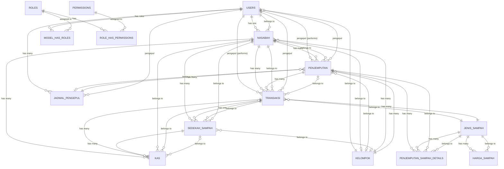

# Table Relationships

At this stage, the table relationships are defined to provide an initial overview of how data in the system will be connected and managed in a structured and efficient manner. Table relationship design is carried out as part of the database design stage, before the system is fully implemented.

Relationships between tables are established using **foreign keys** that reference primary keys in related tables. The **Entity Relationship Diagram (ERD)** with **Crow's Foot notation** is used to visualize these relationships, modeling the connections between entities, their attributes, and cardinality. The relationship design aims to ensure data integrity and avoid redundancy through proper normalization.

**Cardinality** is an important element in table relationships which is used to define the numerical relationship between two tables. Cardinality shows the maximum and minimum number of connections between records in a relationship. The types of cardinality commonly used in database design are as follows:

## 1. One-to-One (1:1)

The one-to-one relationship is a relationship where one data in one entity is only related to one data in another entity, and vice versa.

**Example:**
One user account (`USERS`) only has one customer profile (`NASABAH`), and one customer profile is only owned by one user account. This separation is implemented because not all users are customers; some are admins, collectors (pengepul), or group coordinators. The separation allows flexibility in user role management.

**Implementation in the system:**
- `USERS` ↔ `NASABAH`: A user with the "nasabah" role will have complete data in the `NASABAH` table
- `TRANSAKSI` ↔ `SEDEKAH_SAMPAH`: A transaction can generate one charity donation if the customer chooses to donate

## 2. One-to-Many (1:N) or Many-to-One (N:1)

The one-to-many relationship is a relationship where one data in one entity can be related to many data in another entity, but each data in that entity is only related to one data in the first entity.

**Example:**
One customer (`NASABAH`) can have many pickup requests (`PENJEMPUTAN`), but each pickup request is only owned by one customer. This allows the system to track historical data of all pickup activities performed by each customer, supporting features such as pickup history and transaction reports.

**Other implementations in the system:**
- One collector user (`USERS` with role pengepul) can perform many transactions (`TRANSAKSI`), but each transaction is only performed by one collector
- One waste type (`JENIS_SAMPAH`) can be used in many transactions (`TRANSAKSI`), enabling price history tracking and reporting by waste type
- One pickup (`PENJEMPUTAN`) can generate many transactions (`TRANSAKSI`) for different waste types, allowing detailed recording of payment for each type of waste collected

## 3. Many-to-Many (M:N)

The many-to-many relationship is a relationship where one data in one entity can be related to many data in another entity, and vice versa. This relationship is generally represented using an associative entity (junction table).

**Example:**
One user (`USERS`) can have many roles (`ROLES`), and one role can be owned by many users. For instance, a user can simultaneously be a customer and a group administrator. This relationship is implemented through the `MODEL_HAS_ROLES` associative table, enabling flexible role-based access control (RBAC).

**Other implementations in the system:**
- `ROLES` ↔ `PERMISSIONS`: One role can have many permissions, and one permission can be assigned to many roles. This relationship is implemented through the `ROLE_HAS_PERMISSIONS` table, allowing dynamic permission management without code changes.

---

## Table Relationship Details

The database consists of **22 tables** with **32 relationships** established through foreign keys. The following sections detail each relationship grouped by functional modules.

### User Management and Authentication Module

| Parent Table | Child Table | Relationship | Foreign Key | Cardinality | Description |
|-------------|-------------|--------------|-------------|-------------|-------------|
| USERS | NASABAH | has one | `NASABAH.user_id` → `USERS.id` | 1:1 | One user account has one customer profile (optional) |
| KELOMPOK | USERS | has many | `USERS.kelompok_id` → `KELOMPOK.id` | 1:N | One group has many users as members |
| USERS | MODEL_HAS_ROLES | has many | `MODEL_HAS_ROLES.model_id` → `USERS.id` | 1:N | One user can have multiple roles |
| ROLES | MODEL_HAS_ROLES | assigned to | `MODEL_HAS_ROLES.role_id` → `ROLES.id` | 1:N | One role can be assigned to many users |
| ROLES | ROLE_HAS_PERMISSIONS | has | `ROLE_HAS_PERMISSIONS.role_id` → `ROLES.id` | 1:N | One role has many permissions |
| PERMISSIONS | ROLE_HAS_PERMISSIONS | assigned to | `ROLE_HAS_PERMISSIONS.permission_id` → `PERMISSIONS.id` | 1:N | One permission belongs to many roles |

**Explanation:**
The user management module implements **Role-Based Access Control (RBAC)** using the Spatie Permission package. Users are connected to customers through a one-to-one relationship, allowing separation between authentication accounts and customer business data. The many-to-many relationships between USERS-ROLES and ROLES-PERMISSIONS are implemented through junction tables (`MODEL_HAS_ROLES` and `ROLE_HAS_PERMISSIONS`), enabling flexible access control where one user can have multiple roles (e.g., a user can be both a customer and a group administrator).

### Group and Customer Module

| Parent Table | Child Table | Relationship | Foreign Key | Cardinality | Description |
|-------------|-------------|--------------|-------------|-------------|-------------|
| KELOMPOK | NASABAH | has many | `NASABAH.kelompok_id` → `KELOMPOK.id` | 1:N | One group contains many customers |
| KELOMPOK | PENJEMPUTAN | has many | `PENJEMPUTAN.kelompok_id` → `KELOMPOK.id` | 1:N | One group has many pickup requests |
| KELOMPOK | SEDEKAH_SAMPAH | has many | `SEDEKAH_SAMPAH.kelompok_id` → `KELOMPOK.id` | 1:N | One group has many charity donations |

**Explanation:**
The group module organizes customers based on geographic regions or communities. One group can have many customers, and each customer optionally belongs to one group. This relationship supports features such as group-based reporting, regional scheduling, and community management.

### Waste Pickup Module

| Parent Table | Child Table | Relationship | Foreign Key | Cardinality | Description |
|-------------|-------------|--------------|-------------|-------------|-------------|
| NASABAH | PENJEMPUTAN | requests | `PENJEMPUTAN.nasabah_id` → `NASABAH.id` | 1:N | One customer can request many pickups |
| USERS | PENJEMPUTAN | performs | `PENJEMPUTAN.pengepul_id` → `USERS.id` | 1:N | One collector performs many pickups |
| USERS | JADWAL_PENGEPUL | has many | `JADWAL_PENGEPUL.pengepul_id` → `USERS.id` | 1:N | One collector has many schedules |
| JADWAL_PENGEPUL | PENJEMPUTAN | schedules | `PENJEMPUTAN.jadwal_pengepul_id` → `JADWAL_PENGEPUL.id` | 1:N | One schedule contains many pickups |
| PENJEMPUTAN | PENJEMPUTAN_SAMPAH_DETAILS | has many | `PENJEMPUTAN_SAMPAH_DETAILS.penjemputan_id` → `PENJEMPUTAN.id` | 1:N | One pickup has many waste type details |
| JENIS_SAMPAH | PENJEMPUTAN_SAMPAH_DETAILS | categorizes | `PENJEMPUTAN_SAMPAH_DETAILS.jenis_sampah_id` → `JENIS_SAMPAH.id` | 1:N | One waste type appears in many pickup details |

**Explanation:**
The waste pickup module manages the complete pickup workflow. When a customer creates a pickup request, the system records it in the PENJEMPUTAN table with a reference to the customer (`nasabah_id`). The customer can select multiple waste types, which are stored in PENJEMPUTAN_SAMPAH_DETAILS as a one-to-many relationship. When a collector accepts the pickup, the `pengepul_id` is filled with the collector's user ID. The collector can also associate the pickup with their schedule through `jadwal_pengepul_id`.

### Transaction and Payment Module

| Parent Table | Child Table | Relationship | Foreign Key | Cardinality | Description |
|-------------|-------------|--------------|-------------|-------------|-------------|
| NASABAH | TRANSAKSI | receives | `TRANSAKSI.nasabah_id` → `NASABAH.id` | 1:N | One customer receives many transactions |
| USERS | TRANSAKSI | performs | `TRANSAKSI.pengepul_id` → `USERS.id` | 1:N | One collector performs many payment transactions |
| PENJEMPUTAN | TRANSAKSI | generates | `TRANSAKSI.penjemputan_id` → `PENJEMPUTAN.id` | 1:N | One pickup generates many transactions |
| JENIS_SAMPAH | TRANSAKSI | categorizes | `TRANSAKSI.jenis_sampah_id` → `JENIS_SAMPAH.id` | 1:N | One waste type is used in many transactions |
| TRANSAKSI | SEDEKAH_SAMPAH | generates | `SEDEKAH_SAMPAH.transaksi_id` → `TRANSAKSI.id` | 1:1 | One transaction generates one charity donation (optional) |

**Explanation:**
The transaction module handles payment processing from collectors to customers. After a pickup is completed, the system generates transactions for each waste type collected. Each transaction references the customer who receives payment (`nasabah_id`), the collector who makes payment (`pengepul_id`), the source pickup (`penjemputan_id`), and the waste type (`jenis_sampah_id`). If the customer chooses to donate, a one-to-one relationship creates a record in SEDEKAH_SAMPAH. The transaction system supports dual verification where both customers and administrators can verify transactions through `verified_by_nasabah` and `verified_by_admin` fields.

### Financial Management Module

| Parent Table | Child Table | Relationship | Foreign Key | Cardinality | Description |
|-------------|-------------|--------------|-------------|-------------|-------------|
| NASABAH | KAS | owns | `KAS.nasabah_id` → `NASABAH.id` | 1:N | One customer has many cash records |
| TRANSAKSI | KAS | recorded in | `KAS.transaksi_id` → `TRANSAKSI.id` | 1:N | One transaction creates cash records |
| SEDEKAH_SAMPAH | KAS | recorded in | `KAS.sedekah_sampah_id` → `SEDEKAH_SAMPAH.id` | 1:N | One charity donation creates cash records |
| NASABAH | SEDEKAH_SAMPAH | donates | `SEDEKAH_SAMPAH.nasabah_id` → `NASABAH.id` | 1:N | One customer makes many charity donations |

**Explanation:**
The financial module tracks all cash flow in the system through the KAS table. Every financial transaction is recorded with references to its source (customer, transaction, or charity). The system maintains snapshots of balances before and after each transaction (`saldo_sebelum` and `saldo_sesudah`) to provide a complete audit trail. This design allows generating detailed financial reports by customer, transaction type, or time period while ensuring data integrity and traceability.

### Master Data Module

| Parent Table | Child Table | Relationship | Foreign Key | Cardinality | Description |
|-------------|-------------|--------------|-------------|-------------|-------------|
| JENIS_SAMPAH | HARGA_SAMPAH | has many | `HARGA_SAMPAH.jenis_sampah_id` → `JENIS_SAMPAH.id` | 1:N | One waste type has many price history records |
| USERS | ARTIKEL | authors | `ARTIKEL.author_id` → `USERS.id` | 1:N | One user authors many articles |
| USERS | LOG_AKTIVITAS | performs | `LOG_AKTIVITAS.user_id` → `USERS.id` | 1:N | One user generates many activity logs |
| USERS | NOTIFICATIONS | receives | `NOTIFICATIONS.user_id` → `USERS.id` | 1:N | One user receives many notifications |
| NASABAH | NOTIFICATIONS | receives | `NOTIFICATIONS.nasabah_id` → `NASABAH.id` | 1:N | One customer receives many notifications |
| USERS | PENGELUARAN | approves | `PENGELUARAN.approved_by` → `USERS.id` | 1:N | One user approves many expenditures |
| USERS | PENGGUNAAN_DANAS | creates | `PENGGUNAAN_DANAS.created_by` → `USERS.id` | 1:N | One user records many fund usages |

**Explanation:**
The master data module manages reference data and system features. The JENIS_SAMPAH table maintains waste type master data with price history tracking through HARGA_SAMPAH, allowing the system to record price changes over time while keeping historical transaction data accurate. The notification system can send messages to both users and customers, supporting various notification types (transaction, pickup, charity, system). Activity logging provides audit trails for all user actions, recording IP addresses and user agents for security purposes.

---

## Summary of Relationships

The table relationship design implements **32 relationships** across **22 tables** with the following distribution:

### By Cardinality Type
- **One-to-One (1:1)**: 2 relationships
  - USERS ↔ NASABAH (one user has one customer profile)
  - TRANSAKSI ↔ SEDEKAH_SAMPAH (one transaction generates one charity donation)

- **One-to-Many (1:N)**: 28 relationships
  - Hierarchical relationships (group-customer, customer-pickup)
  - Master-detail relationships (pickup-details, waste type-transactions)
  - Audit trail relationships (user-logs, transaction-cash records)

- **Many-to-Many (M:N)**: 2 relationships (implemented via junction tables)
  - USERS ↔ ROLES (through MODEL_HAS_ROLES)
  - ROLES ↔ PERMISSIONS (through ROLE_HAS_PERMISSIONS)

### By Module
- **User Management**: 6 relationships
- **Group and Customer**: 3 relationships
- **Waste Pickup**: 6 relationships
- **Transaction and Payment**: 5 relationships
- **Financial Management**: 4 relationships
- **Master Data**: 7 relationships

### Key Design Principles

The table relationships are designed following these principles:

1. **Referential Integrity**: All foreign keys are properly constrained with appropriate CASCADE, SET NULL, or RESTRICT rules to maintain data consistency.

2. **Normalization**: The design follows Third Normal Form (3NF) to eliminate data redundancy while maintaining query efficiency. For example, waste prices are separated into HARGA_SAMPAH to track price history without affecting existing transactions.

3. **Flexibility**: Optional foreign keys (nullable) are used where relationships are not mandatory, such as `PENJEMPUTAN.pengepul_id` (pickup may not yet have an assigned collector) or `USERS.kelompok_id` (not all users belong to a group).

4. **Audit Trail**: Soft delete columns (`deleted_at`) are used in tables like KELOMPOK, NASABAH, JENIS_SAMPAH, and ARTIKEL to preserve historical data while allowing logical deletion.

5. **Performance Optimization**: Strategic denormalization is applied where necessary, such as storing `NASABAH.saldo` (current balance) to avoid expensive aggregation queries on the KAS table, while still maintaining the complete cash record history.

---

## Appendix: Entity Relationship Diagram

The following diagram provides a visual representation of the table relationships using Crow's Foot notation:

---

**Note**: The ERD diagram is provided as a visual reference. Detailed relationship information is documented in the "Table Relationship Details" section above.

