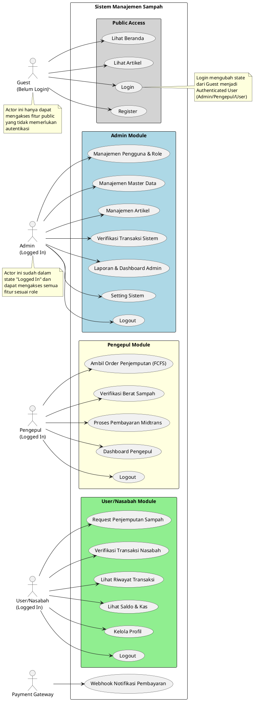
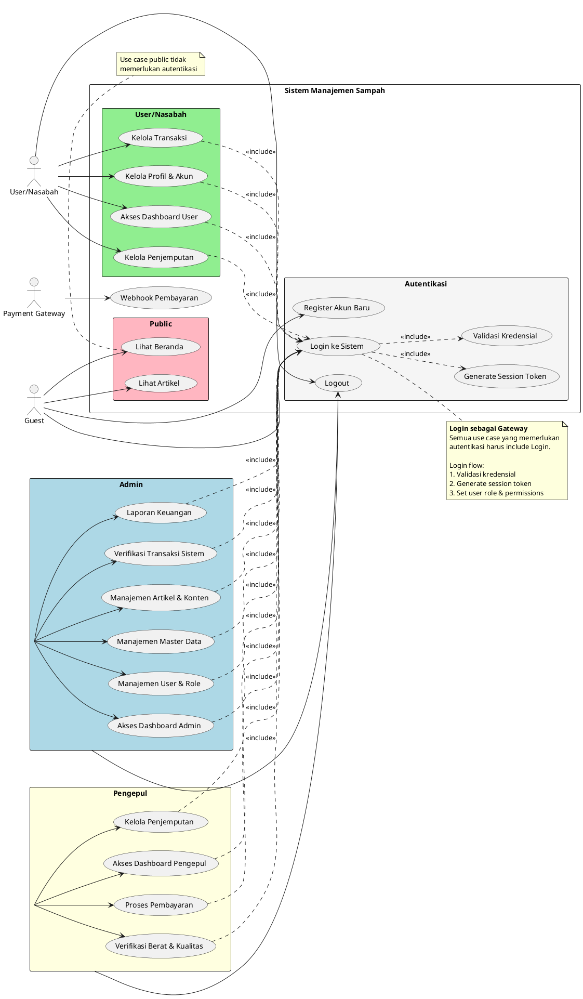

# Use Case Diagram - 3 Alternatif dengan Login Integration

Dokumen ini menyajikan **3 versi alternatif** Use Case Diagram untuk Sistem Manajemen Sampah dengan integrasi Login/Autentikasi.

---

## Versi A: Include Relationship dari Use Case ke Login

**Konsep:** Setiap use case yang memerlukan autentikasi memiliki relasi `<<include>>` ke "Login" sebagai prerequisite.

**Kelebihan:**
- ✅ Jelas menunjukkan dependency autentikasi
- ✅ Sesuai dengan UML best practice untuk menunjukkan common functionality
- ✅ Login terlihat sebagai use case yang reusable

**Kekurangan:**
- ❌ Diagram bisa menjadi ramai dengan banyak garis include
- ❌ Perlu menggambar banyak relasi

### PlantUML Code - Versi A (Rapi, Tanpa Kotak)

```plantuml
@startuml UseCase_VersiA_Clean
left to right direction
skinparam packageStyle rectangle

' ===== ACTORS =====
actor "Admin" as Admin
actor "Pengepul" as Pengepul
actor "User/Nasabah" as User
actor "Guest" as Guest
actor "Payment Gateway" as Payment

rectangle "Sistem Manajemen Sampah" {
  
  ' ===== AUTENTIKASI (CENTER) =====
  usecase "Login" as UC_Login #LightYellow
  usecase "Logout" as UC_Logout
  usecase "Register" as UC_Register
  usecase "Lihat Beranda & Artikel" as UC_Beranda
  
  ' ===== ADMIN USE CASES =====
  usecase "Kelola Pengguna & Role" as UC_Admin_User
  usecase "Kelola Nasabah & Kelompok" as UC_Admin_Nasabah
  usecase "Kelola Jenis Sampah" as UC_Admin_JenisSampah
  usecase "Kelola Harga Sampah" as UC_Admin_Harga
  usecase "Kelola Artikel" as UC_Admin_Artikel
  usecase "Kelola Setting Sistem" as UC_Admin_Setting
  usecase "Kelola Jadwal Pengepul" as UC_Admin_Jadwal
  usecase "Verifikasi Transaksi Sistem" as UC_Admin_VerifSistem
  usecase "Verifikasi Transaksi Nasabah" as UC_Admin_VerifNasabah
  usecase "Kelola Pengeluaran" as UC_Admin_Pengeluaran
  usecase "Laporan Keuangan" as UC_Admin_LapKeuangan
  usecase "Laporan Penjemputan" as UC_Admin_LapPenjemputan
  usecase "Laporan Donasi Sistem" as UC_Admin_LapDonasi
  usecase "Dashboard Admin" as UC_Admin_Dashboard
  usecase "Log Aktivitas" as UC_Admin_Log
  
  ' ===== PENGEPUL USE CASES =====
  usecase "Dashboard Pengepul" as UC_Peng_Dashboard
  usecase "Lihat Daftar Penjemputan" as UC_Peng_Lihat
  usecase "Ambil Order (FCFS)" as UC_Peng_Ambil
  usecase "Mulai Penjemputan" as UC_Peng_Mulai
  usecase "Verifikasi Berat Sampah" as UC_Peng_Verif
  usecase "Selesai Penjemputan" as UC_Peng_Selesai
  usecase "Hitung Total Pembayaran" as UC_Peng_Hitung
  usecase "Proses Pembayaran Midtrans" as UC_Peng_Bayar
  usecase "Lihat Transaksi & Kas" as UC_Peng_Transaksi
  
  ' ===== USER/NASABAH USE CASES =====
  usecase "Dashboard User" as UC_User_Dashboard
  usecase "Request Penjemputan" as UC_User_Request
  usecase "Input Estimasi Berat" as UC_User_InputBerat
  usecase "Pilih Opsi Pembayaran" as UC_User_PilihOpsi
  usecase "Batalkan Penjemputan" as UC_User_Batal
  usecase "Verifikasi Transaksi" as UC_User_Verif
  usecase "Setujui/Tolak Transaksi" as UC_User_SetujuTolak
  usecase "Lihat Riwayat Penjemputan" as UC_User_RiwayatPenjemputan
  usecase "Lihat Riwayat Transaksi" as UC_User_RiwayatTransaksi
  usecase "Lihat Saldo & Kas" as UC_User_Saldo
  usecase "Kelola Profil" as UC_User_Profile
  usecase "Ubah Password" as UC_User_Password
  
  ' ===== PAYMENT GATEWAY =====
  usecase "Webhook Notifikasi Pembayaran" as UC_Payment_Webhook
  
}

' ===== GUEST RELATIONSHIPS (NO LOGIN) =====
Guest --> UC_Register
Guest --> UC_Login
Guest --> UC_Beranda

' ===== ADMIN RELATIONSHIPS =====
Admin --> UC_Admin_User
Admin --> UC_Admin_Nasabah
Admin --> UC_Admin_JenisSampah
Admin --> UC_Admin_Harga
Admin --> UC_Admin_Artikel
Admin --> UC_Admin_Setting
Admin --> UC_Admin_Jadwal
Admin --> UC_Admin_VerifSistem
Admin --> UC_Admin_VerifNasabah
Admin --> UC_Admin_Pengeluaran
Admin --> UC_Admin_LapKeuangan
Admin --> UC_Admin_LapPenjemputan
Admin --> UC_Admin_LapDonasi
Admin --> UC_Admin_Dashboard
Admin --> UC_Admin_Log
Admin --> UC_Logout

' ===== PENGEPUL RELATIONSHIPS =====
Pengepul --> UC_Peng_Dashboard
Pengepul --> UC_Peng_Lihat
Pengepul --> UC_Peng_Ambil
Pengepul --> UC_Peng_Mulai
Pengepul --> UC_Peng_Verif
Pengepul --> UC_Peng_Selesai
Pengepul --> UC_Peng_Hitung
Pengepul --> UC_Peng_Bayar
Pengepul --> UC_Peng_Transaksi
Pengepul --> UC_Logout

' ===== USER/NASABAH RELATIONSHIPS =====
User --> UC_User_Dashboard
User --> UC_User_Request
User --> UC_User_InputBerat
User --> UC_User_PilihOpsi
User --> UC_User_Batal
User --> UC_User_Verif
User --> UC_User_SetujuTolak
User --> UC_User_RiwayatPenjemputan
User --> UC_User_RiwayatTransaksi
User --> UC_User_Saldo
User --> UC_User_Profile
User --> UC_User_Password
User --> UC_Logout

' ===== PAYMENT GATEWAY =====
Payment --> UC_Payment_Webhook

' ===== INCLUDE RELATIONSHIPS - ADMIN (LOGIN REQUIRED) =====
UC_Admin_User ..> UC_Login : <<include>>
UC_Admin_Nasabah ..> UC_Login : <<include>>
UC_Admin_JenisSampah ..> UC_Login : <<include>>
UC_Admin_Harga ..> UC_Login : <<include>>
UC_Admin_Artikel ..> UC_Login : <<include>>
UC_Admin_Setting ..> UC_Login : <<include>>
UC_Admin_Jadwal ..> UC_Login : <<include>>
UC_Admin_VerifSistem ..> UC_Login : <<include>>
UC_Admin_VerifNasabah ..> UC_Login : <<include>>
UC_Admin_Pengeluaran ..> UC_Login : <<include>>
UC_Admin_LapKeuangan ..> UC_Login : <<include>>
UC_Admin_LapPenjemputan ..> UC_Login : <<include>>
UC_Admin_LapDonasi ..> UC_Login : <<include>>
UC_Admin_Dashboard ..> UC_Login : <<include>>
UC_Admin_Log ..> UC_Login : <<include>>

' ===== INCLUDE RELATIONSHIPS - PENGEPUL (LOGIN REQUIRED) =====
UC_Peng_Dashboard ..> UC_Login : <<include>>
UC_Peng_Lihat ..> UC_Login : <<include>>
UC_Peng_Ambil ..> UC_Login : <<include>>
UC_Peng_Mulai ..> UC_Login : <<include>>
UC_Peng_Verif ..> UC_Login : <<include>>
UC_Peng_Selesai ..> UC_Login : <<include>>
UC_Peng_Hitung ..> UC_Login : <<include>>
UC_Peng_Bayar ..> UC_Login : <<include>>
UC_Peng_Transaksi ..> UC_Login : <<include>>

' ===== INCLUDE RELATIONSHIPS - USER/NASABAH (LOGIN REQUIRED) =====
UC_User_Dashboard ..> UC_Login : <<include>>
UC_User_Request ..> UC_Login : <<include>>
UC_User_InputBerat ..> UC_Login : <<include>>
UC_User_PilihOpsi ..> UC_Login : <<include>>
UC_User_Batal ..> UC_Login : <<include>>
UC_User_Verif ..> UC_Login : <<include>>
UC_User_SetujuTolak ..> UC_Login : <<include>>
UC_User_RiwayatPenjemputan ..> UC_Login : <<include>>
UC_User_RiwayatTransaksi ..> UC_Login : <<include>>
UC_User_Saldo ..> UC_Login : <<include>>
UC_User_Profile ..> UC_Login : <<include>>
UC_User_Password ..> UC_Login : <<include>>

' ===== NOTES =====
note right of UC_Login
  <b>Gateway Autentikasi</b>
  
  Semua use case yang memerlukan
  autentikasi harus include Login.
  
  Login akan:
  • Validasi kredensial
  • Generate session token
  • Set role & permissions
end note

note bottom of UC_Beranda
  Use case public
  (tidak perlu login)
end note

@enduml
```

---

## Versi B: Separated Actors (Guest vs Authenticated Users)

**Konsep:** Memisahkan actor Guest (belum login) dengan actor yang sudah authenticated (Admin, Pengepul, User). Login adalah use case yang mengubah state dari Guest menjadi Authenticated User.

**Kelebihan:**
- ✅ Diagram lebih bersih tanpa banyak relasi include
- ✅ Jelas membedakan state sebelum dan sesudah login
- ✅ Lebih mudah dibaca

**Kekurangan:**
- ❌ Tidak eksplisit menunjukkan dependency login di setiap use case
- ❌ Bisa ambigu apakah semua use case butuh login

### PlantUML Code - Versi B

---

## Versi C: Centralized Login with Extend

**Konsep:** Login sebagai use case sentral yang di-extend oleh berbagai activity. Menggunakan kombinasi <<include>> untuk prerequisite dan <<extend>> untuk optional flow.

**Kelebihan:**
- ✅ Login sebagai central point yang jelas
- ✅ Menunjukkan flow autentikasi lebih eksplisit
- ✅ Flexible untuk menunjukkan optional vs mandatory login

**Kekurangan:**
- ❌ Bisa membingungkan penggunaan include vs extend
- ❌ Agak berbeda dari UML standard practice

### PlantUML Code - Versi C

---

## Perbandingan Ketiga Versi

| Aspek | Versi A (Include) | Versi B (Separated Actors) | Versi C (Centralized) |
|-------|-------------------|----------------------------|----------------------|
| **Kompleksitas Diagram** | Tinggi (banyak garis) | Rendah (clean) | Sedang |
| **Kejelasan Dependency** | ✅ Sangat jelas | ⚠️ Implisit | ✅ Jelas |
| **UML Best Practice** | ✅ Sesuai standar | ✅ Sesuai standar | ⚠️ Hybrid approach |
| **Kemudahan Dibaca** | ⚠️ Ramai | ✅ Mudah | ✅ Cukup mudah |
| **Maintenance** | ⚠️ Sulit (banyak relasi) | ✅ Mudah | ✅ Mudah |
| **Cocok untuk Akademik** | ✅ Ya | ✅ Ya | ✅ Ya |
| **Cocok untuk Presentasi** | ⚠️ Terlalu detail | ✅ Bagus | ✅ Bagus |

## Rekomendasi

### Untuk Skripsi/Thesis:
**Gunakan Versi B (Separated Actors)** karena:
- ✅ Diagram lebih clean dan mudah dipahami pembaca
- ✅ Jelas membedakan state authenticated vs unauthenticated
- ✅ Fokus pada business process, bukan technical detail
- ✅ Cocok untuk presentasi dan dokumentasi

### Untuk Dokumentasi Teknis:
**Gunakan Versi A (Include Relationship)** karena:
- ✅ Menunjukkan dependency secara eksplisit
- ✅ Developer lebih mudah memahami flow autentikasi
- ✅ Sesuai dengan UML best practice

### Untuk Presentasi Eksekutif:
**Gunakan Versi C (Centralized)** karena:
- ✅ Login sebagai central point yang jelas
- ✅ Menunjukkan security aspect dengan baik
- ✅ Balance antara detail dan simplicity

---

## Cara Menggunakan PlantUML

1. **Online**: Buka https://www.plantuml.com/plantuml/uml/
2. **VS Code**: Install extension "PlantUML"
3. **IntelliJ/PhpStorm**: Built-in support
4. **Export**: Bisa export ke PNG, SVG, atau PDF

## Catatan Tambahan

- Semua versi sudah include use case Login/Logout
- Payment Gateway sebagai external actor untuk webhook
- Warna package memudahkan identifikasi modul
- Gunakan notes untuk menjelaskan konsep penting

**Pilih versi mana yang paling sesuai dengan kebutuhan dokumentasi Anda!**
